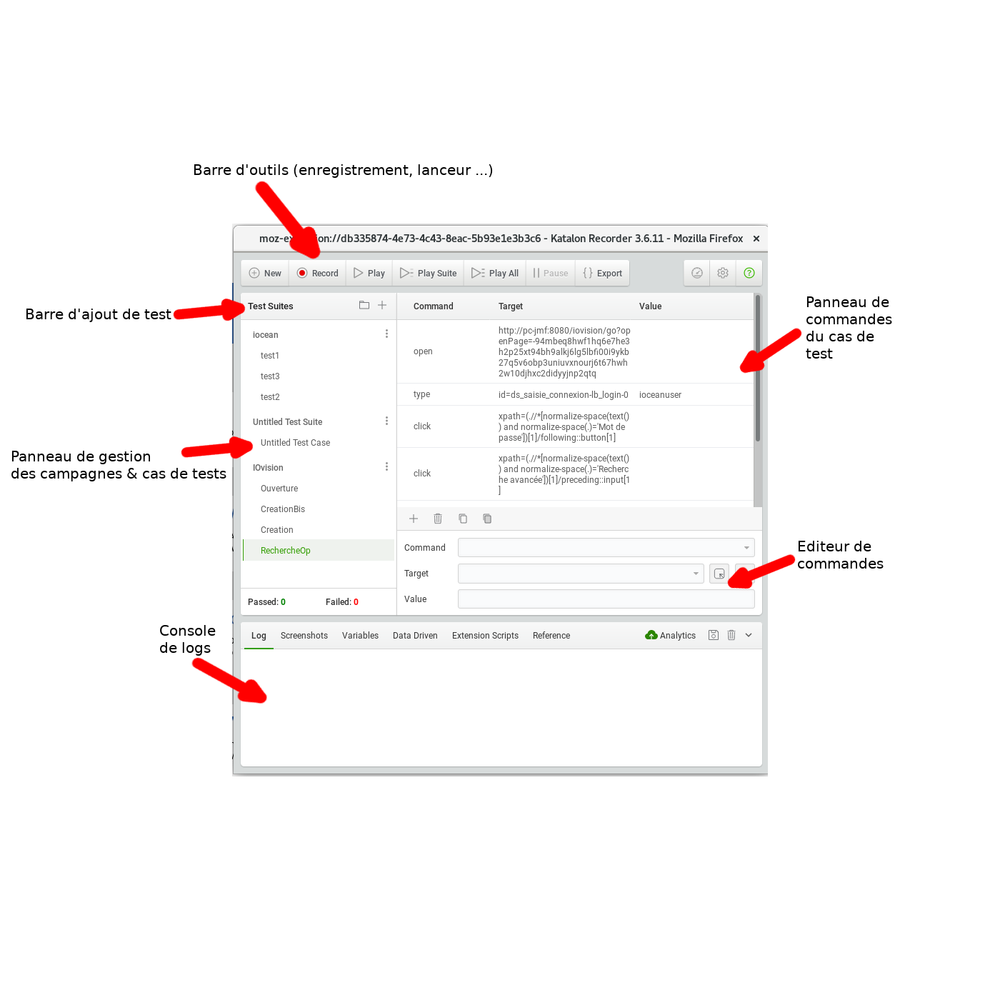

==== Utilisation de Katalon
Katalon studio fonctionne exactement comme Selenium IDE, à la différence près que Selenium
IDE, dans ces dernières version ne permet plus les exports Java/Junit.

* Cliquez sur l’icône image:img/katalon_logo.png[katalon_logo,20] du navigateur.
* l'application katalon s'ouvre :

* Dans la barre d'ajout de test, cliquer sur l’icône `+` et donner un nom à votre campagne de test

image::img/katalon_ajout_campagne.png[katalon_ajout_campagne,200, 300]
* Dans le panneau de gestion des tests, une nouvelle campagne apparait
* Cliquer sur les 3 points à coté de cette campagne et cliquer sur ajouter un nouveau cas de test

image::img/katalon_ajout_test.png[katalon_ajout_test,200, 300]
* Choisir un nom au cas test (ici Test1)
* Cliquer sur enregistrer & dérouler le cas de test dans le navigateur

image::img/katalon_enregistrement_test.png[katalon_enregistrement_test,200, 300]
* Katalon enregistre les commandes liées aux événements générés par les interactions utilisateurs.
* Une fois le cas de test terminé, cliquer sur stop.

image::img/katalon_enregistrement_stop.png[katalon_enregistrement_stop,200, 300]
* Il est possible d'ajouter des commandes depuis l'éditeur de commandes telles que :
** AssertElementPresent pour vérifier qu'un élément de la page existe
** pause pour mettre le test en attente un certain temps

* Cliquer sur exporter et choisir le format `Java (WebDriver + JUnit)`

image::img/katalon_export.png[katalon_export,200, 300]
image::img/katalon_export_format.png[katalon_export_format,200, 300]

* Dans la classe généré, copier la méthode de test annotée `@Test`

image::img/katalon_test_copie.png[katalon_test_copie,200, 300]

==== Utilisation de Selenium WebDriver dans Intellij
* Télécharger les sources du projet `JUnitSelenium` sur le dépôt git :
[source, bash]
----
git clone <url du dépôt>
----

* Ouvrir le projet depuis Intellij :
** File > New > Project From Existing Sources
** Choisir le dépôt local où se trouve les sources téléchargées
** Suivre les indications de l'éditeur
* Ajouter / Modifier un test :
** se rendre dans JUnitSelenium.src.test.java.tests
** copier un classe de test existant autre que `AbstractTest`
** Nommer la nouvelle classe avec le nom de la campagne créée sous katalon
** Dans cette classe, renommer la méthode de test avec le nom du cas de test saisie sous katalon_logo
** coller la méthode copier dans l'export katalon dans la méthode renommer.

==== Utilisation du Job jenkins
* Se rendre sur l’URL Jenkins
* Cliquer sur `Nouveau Item`
* Nommer le nouveau job & dans la partie `copier depuis` entrer `JUnitSelenium`
* Le nouveau job apparait dans la liste d'accueil.
* le sélectionner, & cliquer sur configurer
* Dans la partie `gestion de code source`, définir le dépôt choisit pour les sources du projet `JUnitSelenium` & cliquer sur `Sauver`
* Cliquer sur `lancer un build avec des paramètres`
** Choisir le fichier de cas de test exporter en csv
** Entrer le numéro de la colonne qui contient les noms de campagne de test  dans le fichier de cas de test (csv)
** Entrer, si besoin, les noms des campagnes à dérouler séparées par un espace.
** Cliquer sur Build
* Une fois le Build terminer, se rendre dans l'espace de travail
* Ouvrir le fichier `res.csv`
* Il correspond au fichier de test fourni en entrée avec une colonne de résultat en plus :
** OK si le test s'est bien déroulé
** Ignore si le test ne fait pas partie de la liste fournie dans les paramètres
** KO si le test n'a pas fonctionné
*** Dans ce cas, se rendre dans les logs de jenkins (console Output) pour voir l'erreur remontée
